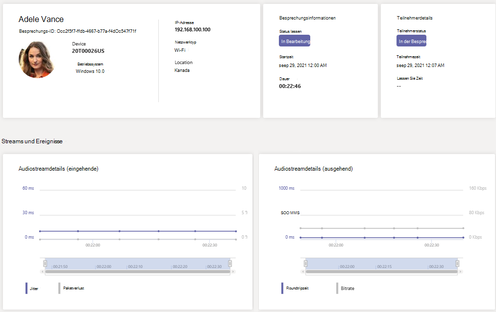

# Verwenden von Echtzeit-Telemetrie zur Problembehandlung bei schlechter Besprechungsqualität

> [!NOTE]
> Dieses Feature befindet sich derzeit in Public Preview.

In diesem Artikel wird erläutert, wie Sie mit Echtzeit-Telemetrie probleme mit Microsoft Teams Qualität einzelner Benutzer beheben können. Sie können Die Telemetrie in Echtzeit sehen, wenn Sie über eine der folgenden Rollen verfügen:

- Teams-Administrator
- Supportfachmann für die Teams-Kommunikation
- Teams-Kommunikationssupporttechniker

Weitere Informationen zu Teams Administratorrollen finden Sie unter Verwenden [Microsoft Teams administratorrollen zum Verwalten Teams.](/MicrosoftTeams/using-admin-roles)

Mit Telemetrie in Echtzeit können IT-Administratoren die geplanten Besprechungen ihrer wichtigen Benutzer sowie Audio-, Video-, Inhaltsfreigabe- und netzwerkbezogene Probleme anzeigen. Als Administrator können Sie Telemetrie verwenden, um diese Probleme in Besprechungen zu untersuchen und die Problembehandlung in Echtzeit zu nutzen.

## Was ist Echtzeit-Telemetrie?

Heute steht die Problembehandlung einzelner Besprechungen für Teams Administratoren über die [Anrufanalyse](use-call-analytics-to-troubleshoot-poor-call-quality.md) nach dem Ende der Besprechung zur Verfügung. Mithilfe der Echtzeit-Telemetrie können Administratoren geplante Besprechungen während des Gesprächs behandeln.

Die Echtzeit-Telemetrie zeigt detaillierte Informationen zu Teams Besprechungen für jeden Benutzer in Ihrem Office 365 in Echtzeit aktualisiert an. Sie enthält Informationen zu Geräten, Netzwerk, Konnektivität, Audio-, Video- und Inhaltsfreigabeproblemen, die Administratoren bei einer effektiveren Problembehandlung bei der Anrufqualität unterstützen.

Als Teams erhalten Sie Vollzugriff auf alle Echtzeit-Telemetriedaten für jeden Benutzer. Darüber hinaus können Sie den Mitarbeitern Azure Active Directory Rollen zuweisen. Weitere Informationen zu diesen Rollen finden Sie unter [Erteilen von Berechtigungen für Support- und Helpdesk-Mitarbeiter.](set-up-call-analytics.md#give-permission-to-support-and-helpdesk-staff)

## Wo finde ich Echtzeit-Problembehandlung für Telemetriedaten pro Benutzer?

Um alle Besprechungsinformationen und Daten für einen Benutzer zu sehen, wechseln Sie zum [Teams Admin Center](https://admin.teams.microsoft.com). Wählen **Sie unter** Benutzer verwalten einen Benutzer aus, und öffnen Sie die Registerkarte & Besprechungen und Anrufe auf der  >  Profilseite des Benutzers.  Unter **Aktuelle Besprechungen** wird eine Liste der Besprechungen angezeigt, an denen der Benutzer innerhalb der letzten 24 Stunden teilgenommen hat, für die *Echtzeit-Telemetrie* zur Verfügung steht, einschließlich aller in Bearbeitung ausgeführten Besprechungen. Wenn die Besprechung noch nicht läuft oder keine Echtzeit-Telemetriedaten enthält, werden diese in Vergangene **Besprechungen angezeigt.**

Um weitere Informationen zu den Teilnehmern einer aktuellen Besprechung zu erhalten, einschließlich Geräte-, Netzwerk- und Audiostatistiken, suchen Sie die Besprechung **unter** Aktuelle Besprechungen, und wählen Sie den Link unter der Spalte **Teilnehmer** aus.

Wenn Sie die Telemetrie eines bestimmten Benutzers für eine in Bearbeitung ausgeführte Besprechung in Echtzeit anzeigen möchten, einschließlich Informationen zu Gerät, Netzwerk, Audio, Video und Inhaltsfreigabe, wählen Sie die Besprechungs-ID **aus.**

## Für Echtzeit-Telemetrie unterstützte Plattformen

- Windows
- macOS
- Linux
- Android
- iOS

## Teams-Geräteunterstützung mit Echtzeit-Telemetrie

- MTR - Surface Hub
- MTR – Teams Display
- MTR – Zusammenarbeitsleiste
- IP Telefon Geräte

## Einschränkungen

- Echtzeit-Telemetrie ist nur für geplante Besprechungen verfügbar. Bei Ad-hoc-Besprechungen wie "Jetztbesprechung", "PSTN", 1:1-Anrufen und Gruppenanrufen funktioniert die Echtzeit-Telemetrie nicht.
- Echtzeit-Telemetrie ist nur für Moderatoren eines geplanten Live-Ereignisses verfügbar. Es steht derzeit für Teilnehmer an Live-Veranstaltungen nicht zur Verfügung.
- Echtzeit-Telemetriedaten stehen für eine  Besprechung unter Letzte Besprechungen für 24 Stunden nach Dem Ende der Besprechung zur Verfügung. Nach 24 Stunden können Sie nicht mehr auf die Daten zugreifen, und die Besprechung wechselt zu Vergangene **Besprechungen.** Wenn eine Besprechung länger als 3 Stunden dauert, steht die Echtzeit-Telemetrie nur für die letzten *3 Stunden zur Verfügung.*
- Telemetrie funktioniert nicht mit älteren Versionen Teams. Wenn keine Telemetrie verfügbar ist, versuchen Sie, Ihren Client zu aktualisieren.
- Wenn externe Teilnehmer oder anonyme Benutzer an einer  Besprechung teilnehmen, wird der Anzeigename als nicht verfügbar angezeigt, um die Mandantenübergreifende Privatsphäre zu bewahren.

## Verwandte Themen

[Einrichten der Anrufanalyse pro Benutzer](set-up-call-analytics.md)

[Verwenden Microsoft Teams Administratorrollen zum Verwalten von Teams.](/MicrosoftTeams/using-admin-roles)
