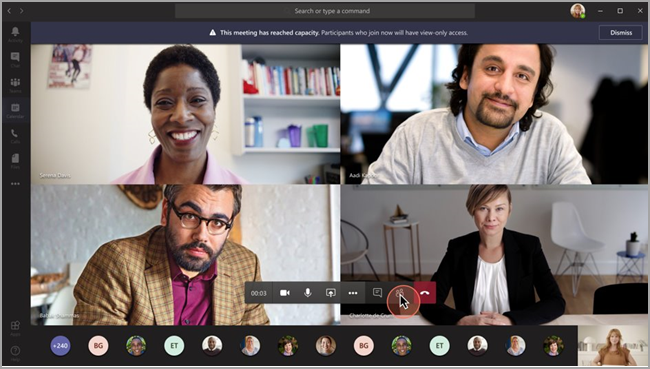

# <a name="teams-view-only-meeting-experience"></a>Schreibgeschützte Teams-Besprechungserfahrung

> [!Note]
> Schreibgeschützte Übertragungen sind verfügbar in Microsoft 365 E3/E3/E5 und Microsoft 365 A3/A5. Dieses Feature wird am 1. März 2021 aktiviert werden, mit Standardeinstellung „DEAKTIVIERT“. Das Feature wird in der Microsoft 365 Government Community Cloud (GCC) gegen Ende März 2021 eingeführt. Für die Government Community Cloud High (GCCH) und das Verteidigungsministerium (Department of Defense, DoD) wird dies zu einem späteren Zeitpunkt eingeführt. Sie müssen nach diesem Datum die Standardrichtlinie ändern, wenn Sie möchten, dass das Feature standardmäßig AKTIVIERT ist. Verwenden Sie PowerShell, um die Richtlinie `Set-CsTeamsMeetingPolicy -Identity Global -StreamingAttendeeMode Enabled` zu aktivieren.

> [!Note]
> Wenn Ihre Besprechung die Kapazitätsgrenze erreicht, lässt sich Teams nahtlos skalieren, um eine schreibgeschützte Übertragung für 10.000 Personen zu ermöglichen. Außerdem können Sie in dieser Zeit der vermehrten Remotearbeit bis zum Ende des Jahres von noch größeren Übertragungen für 20 000 Personen profitieren. Webinare unterstützen derzeit keine schreibschützte Übertragungserfahrung.

Microsoft Teams ermöglicht bis zu 10 000 Teilnehmern den Beitritt zu einer Teams-Besprechung. Nachdem die Kapazität der Hauptbesprechung erreicht wurde (d. h., wenn 1.000 Benutzer an einer Besprechung teilnehmen), nehmen zusätzliche Teilnehmer mit einer schreibgeschützten Erfahrung teil.

Teilnehmer, die zuerst an der Besprechung teilnehmen, erhalten bis zur Kapazitätsgrenze der Hauptbesprechung die vollständige Teams-Besprechungserfahrung. Sie können Audio und Video freigeben, freigegebene Videos ansehen und im Besprechungschat mitmachen.

Teilnehmer, die der Besprechung nach Erreichen der Kapazitätsgrenze beitreten, werden eine schreibgeschützte Erfahrung erhalten.

Teilnehmer können über Desktop, Web und Teams Mobile (Android und iOS) an der schreibgeschützten Erfahrung teilnehmen.

> [!Note]
> Die aktuelle Kapazitätsgrenze der „Hauptbesprechung“, oder anders ausgedrückt, die Anzahl der vollständig interaktiven Benutzer beträgt 1.000 und umfasst GCC und Webinare.

## <a name="teams-view-only-experience-controls"></a>Steuerelemente für die schreibgeschützte Erfahrung in Teams

Sie aktivieren die schreibgeschützte Erfahrung mithilfe des Cmdlets [`Set-CsTeamsMeetingPolicy`](/powershell/module/skype/set-csteamsmeetingpolicy?view=skype-ps) aus dem [SkypeForBusiness PowerShell-Modul](/powershell/module/skype/?view=skype-ps) oder mindestens Version 2.0.0 des [MicrosoftTeams-Moduls](https://www.powershellgallery.com/packages/MicrosoftTeams).

So verwenden Sie die empfohlenen `MicrosoftTeams`Module:

```PowerShell
Install-Module -Name "MicrosoftTeams" -MinimumVersion 2.0.0
Connect-MicrosoftTeams
```

Sie können den folgenden PowerShell-Codeausschnitt verwenden, um die schreibgeschützte Erfahrung zu aktivieren:

```PowerShell
Set-CsTeamsMeetingPolicy -Identity Global -StreamingAttendeeMode Enabled
```

Zum Deaktivieren der schreibgeschützten Erfahrung können Sie auch PowerShell verwenden.

```PowerShell
Set-CsTeamsMeetingPolicy -Identity Global -StreamingAttendeeMode Disabled
```

In Zukunft können Sie die schreibgeschützte Erfahrung im Teams-Admin Center aktivieren oder deaktivieren.

## <a name="impact-to-users"></a>Auswirkungen auf die Benutzer

Die Erfahrung eines Benutzers wird von mehreren Faktoren abhängen.

Wenn die Kapazitätsgrenze der Hauptbesprechung erreicht ist, kann ein Teilnehmer der Besprechung nicht beitreten, wenn einer der folgenden Punkte zutrifft:

- Ein Administrator hat die schreibgeschützte Erfahrung in Teams für den Organisator oder für den gesamten Mandanten deaktiviert.
- Der Teilnehmer in schreibgeschützter Ansicht kann den Wartebereich nicht umgehen. Wenn beispielsweise ein Organisator einer Besprechung entscheidet, dass nur **Personen in meiner Organisation** den Wartebereich umgehen können und ein Teilnehmer außerhalb der Organisation versucht, als schreibgeschützter Teilnehmer teilzunehmen, kann er nicht beitreten.

Wenn die Kapazitätsgrenze der Hauptbesprechung erreicht wurde, wird dem Besprechungsorganisator und -Referenten ein Banner angezeigt, das sie darüber informiert, dass neue Teilnehmer als schreibgeschützte Teilnehmer beitreten.

  

Wenn die Kapazitätsgrenze der Hauptbesprechung erreicht wurde, werden Besprechungsteilnehmer auf dem Bildschirm vor dem Beitritt informiert, dass sie im schreibgeschützten Modus beitreten werden.

  

Solange es Platz hat, wird ein Benutzer immer der Hauptbesprechung beitreten. Wenn die Hauptbesprechung die Kapazitätsgrenze erreicht und einer oder mehrere Teilnehmer die Hauptbesprechung verlassen, dann hat die Hauptbesprechung wieder verfügbare Kapazität. Teilnehmer, die der Besprechung beitreten (oder wieder beitreten), werden der Hauptbesprechung beitreten, bis diese die Kapazitätsgrenze wieder erreicht. Teilnehmer, die sich in der schreibgeschützten Erfahrung befinden, gelangen nicht automatisch in die Hauptbesprechung, und sie können derzeit auch nicht manuell in die Hauptbesprechung weitergeleitet werden.

Wenn Referenten- und Teilnehmerrollen festgelegt wurden und ein Referent versucht, an einer Besprechung teilzunehmen, nachdem die Hauptbesprechung die Kapazität erreicht hat, wird er als schreibgeschützter Teilnehmer teilnehmen und hat die gleichen Einschränkungen wie andere schreibgeschützte Teilnehmer. Unterstützung, um sicherzustellen, dass alle Referenten an der Hauptbesprechung teilnehmen, wird zu einem späteren Zeitpunkt bereitgestellt. Dem Organisator wird immer ein Platz in der Hauptbesprechung garantiert.

## <a name="impact-to-meeting-presenters-and-organizers"></a>Auswirkungen auf Referenten und Organisatoren von Besprechungen

Zu den Einschränkungen für Besprechungsreferenten und Organisatoren gehören:

- Sie werden keine Informationen über schreibgeschützte Teilnehmer haben. Wir unterstützten EDiscovery für schreibgeschützte Teilnehmer nicht.
- Benutzer in der Hauptbesprechung können keine schreibgeschützten-Teilnehmer sehen.
- Sie können keine schreibgeschützten Teilnehmer aus der Besprechung entfernen.

> [!Note]
> Die Teilnehmeranzahl gibt nur die Personen in der Hauptbesprechung und nicht die Personen im schreibgeschützten Raum an. Deshalb erhalten Referenten keine genaue Anzahl der Personen in der schreibgeschützten Erfahrung.

## <a name="experience-for-view-only-attendees"></a>Erfahrung für schreibgeschützte Teilnehmer

Die schreibgeschützte Teams-Erfahrung erlaubt Teilnehmern Folgendes:

- Sie können den Teilnehmern in der Teams-Hauptbesprechung zuhören.
- Sie können den Video-Feed für aktive Sprecher sehen (wenn der aktive Sprecher Videos teilt).
- Sie können Inhalte sehen, die mit der Desktop- oder Bildschirmfreigabefunktion geteilt werden.

Die folgenden Optionen in Besprechungen stehen den schreibgeschützten Teilnehmern nicht zur Verfügung:

- Sie können der Besprechung nicht beitreten, wenn der Teilnehmer basierend auf festgelegten Wartebereichsrichtlinien oder -Optionen die Berechtigung zum Umgehen des Wartebereichs nicht hat.
- Sie können dem schreibgeschützten Raum nicht mittels Audiokonferenz beitreten.
- Treten Sie dem schreibgeschützten Raum über das Microsoft Teams-Räume-System oder über Cloud Video Interop (CVI)-Dienste bei.
- Sie können ihr Audio oder Video nicht teilen.
- Sie können den Besprechungschat nicht sehen und nicht daran teilnehmen.
- Sie können den Video-Feed von Besprechungsteilnehmern nicht sehen, sofern der Teilnehmer nicht der aktive Sprecher ist.
- Sie können PowerPoint-Dateien sehen, die mit der PowerPoint Live-Freigabefunktion oder mit einzelnen Anwendungsfreigaben (mit Ausnahme der Desktop- oder Bildschirmfreigabefunktion) freigegeben wurden.
- Heben Sie ihre Hand in der Besprechung.
- Senden Sie oder zeigen Sie Reaktionen an.
- Interagieren Sie mit einer beliebigen 3P-App, die in die Teams-Besprechung integriert wird, einschließlich Umfragen.

## <a name="view-only-feature-limitations"></a>Schreibgeschützte Feature-Einschränkungen

- Schreibgeschützte Teilnehmer können Liveuntertitel nur auf dem Desktop und im Web anzeigen. Derzeit werden nur englische Untertitel unterstützt. 
- Schreibgeschützte Teilnehmer können sich nicht für Webinare registrieren.
- Schreibgeschützte Teilnehmer werden durch Streaming-Technologie unterstützt.
- Schreibgeschützte Teilnehmer werden im Anwesenheitsbericht nicht eingeschlossen.
- Schreibgeschützte Teilnehmer werden eine einzelne Videoerfahrung haben. Sie können entweder den aktiven Sprecher sehen, oder den freigegebenen Inhalt, aber nicht beides.
- Derzeit unterstützen wir die Layouts **Galerie**. **Große Galerie** oder **Zusammen-Modus** für schreibgeschützte Teilnehmer nicht.
- Nur anzeigende Teilnehmer werden nur von den folgenden Lobbyrichtlinien unterstützt: "Personen in meiner Organisation", "Personen in meiner Organisation und Gäste", "Personen in meiner Organisation, vertrauenswürdige Organisationen und Gäste" und "Jeder". Wenn Sie eine Lobbyrichtlinie verwenden, die keine schreibgeschützten Teilnehmer unterstützt, werden schreibgeschützte Teilnehmer von der Besprechung abgelehnt. 
- Schreibgeschützte Teilnehmer haben nicht die gleiche Wartezeit wie normale Teilnehmer. <sup>1</sup>

  <sup>1</sup> Schreibgeschützte Teilnehmer werden in der Besprechung eine Verzögerung von 30 Sekunden für Video und Audio haben.  
